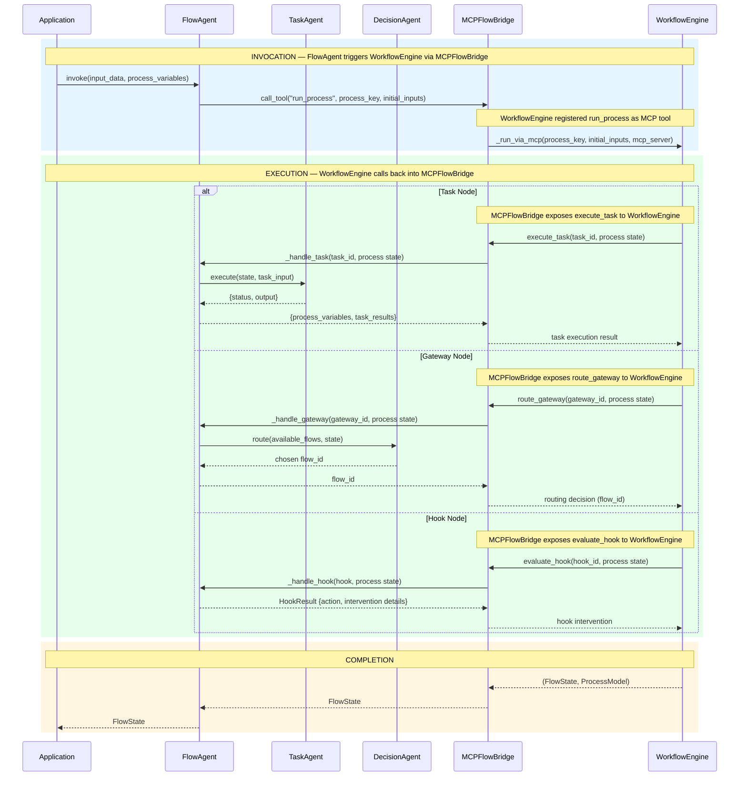

# CUGA FLO — High-Level Sequence Diagram

---

## Component Roles

| Component | Role |
|---|---|
| **FlowAgent** | Orchestrates process execution — receives invocations from the application, drives the WorkflowEngine via MCPFlowBridge, and delegates each node type to the appropriate agent (TaskAgent, DecisionAgent) or handles hooks directly. |
| **TaskAgent** | Executes a single task node — given a task instruction and process state, it runs the LLM-backed action and returns a status/output result. |
| **DecisionAgent** | Resolves gateway routing — evaluates conditions deterministically and, when needed, uses an LLM to select exactly one outgoing flow ID based on gateway policy and process state. |
| **MCPFlowBridge** | Acts as the MCP protocol adapter between CUGA FLO and the WorkflowEngine — exposes `execute_task`, `route_gateway`, and `evaluate_hook` to the engine, and exposes `run_process` (registered by the WorkflowEngine) back to FlowAgent. All invocations go through MCP tool calls, enabling future remote/cross-process transport. |
| **WorkflowEngine** | Drives BPMN process execution — walks the deterministic flow parts task by task, calling back into MCPFlowBridge at each task, gateway, or hook node, and returns the final FlowState on completion. |

---

## MCP Service Contracts

### Services MCPFlowBridge Exposes to WorkflowEngine

| MCP Tool | Called by | Routed to | Input |
|---|---|---|---|
| `execute_task` | WorkflowEngine | FlowAgent → TaskAgent | `task_id`, `process state` |
| `route_gateway` | WorkflowEngine | FlowAgent → DecisionAgent | `gateway_id`, `process state` |
| `evaluate_hook` | WorkflowEngine | FlowAgent | `hook_id`, `process state` |

### Service WorkflowEngine Exposes to CUGA FLO

| MCP Tool | Called by | Handled by | Input |
|---|---|---|---|
| `run_process` | FlowAgent (via MCPFlowBridge) | WorkflowEngine | `process_key`, `initial_inputs` |

---

## CUGA FLO Service Results

### `execute_task` → Result to WorkflowEngine

| Field | Type | Description |
|---|---|---|
| `process_variables` | `Dict[str, Any]` | Updated process variables after output mapping |
| `task_results` | `Dict[str, Dict]` | `{task_id: {status: "completed"\|"error", output: "...", error: "..."}}` |

---

### `route_gateway` → Routing Result to WorkflowEngine

| Field | Type | Description |
|---|---|---|
| `flow_id` | `str` | The single chosen outgoing sequence flow ID (e.g., `"flow_approved"`) |

DecisionAgent resolves the routing via a two-step internal graph:
1. **eval_condition** — deterministic safe-string evaluation of `${var} op value` conditions
2. **decide** — LLM (CugaAgent) reads evaluation result + gateway policy + state and returns exactly one `flow_id`

---

### `evaluate_hook` → Interventions Suggested to WorkflowEngine

| `action` | Effect on WorkflowEngine | Additional Fields |
|---|---|---|
| `CONTINUE` | Proceed normally along the current edge | — |
| `SKIP_NODE` | Skip the immediately next node | `message` |
| `SKIP_TO` | Jump execution to a named node | `skip_to_node: str` |
| `TERMINATE` | Halt the process immediately | `message` |
| `SWAP_NODES` | Exchange two nodes in the current graph | `swap_nodes: (node_a, node_b)` |
| `REMOVE_NODE` | Remove a node and rewire surrounding flows | `remove_node: str` |
| `ADD_NODE` | Insert a new node before target (triggers graph rebuild) | `add_node: {node_id, task_instruction}` |