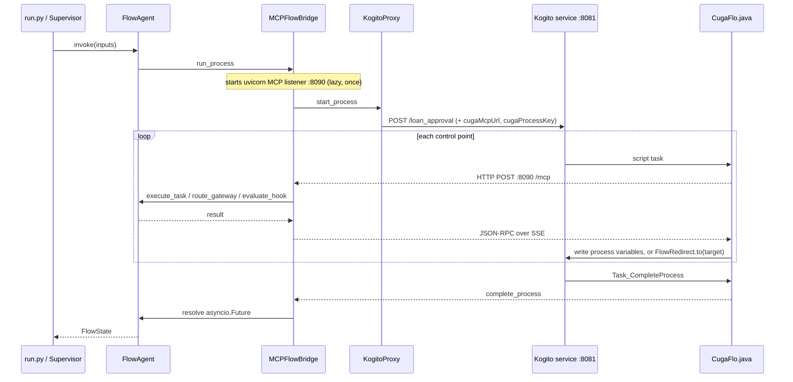

# CUGA FLO ↔ Apache KIE (Kogito) — Integration Report

**Status:** complete and verified against a live Kogito service with real LLM reasoning.
**Stack:** Apache KIE / Kogito 10.2.0 · Quarkus 3.27.2 · JDK 17.
**Delivered in:** 19 commits on `cugaflo`.

---

## 1. Objective and outcome

Add Apache KIE (Kogito) as a third `WorkflowEngine` alongside LangGraph (in-process demo)
and Flowable, so a BPMN process can execute on a Kogito/Quarkus service while CUGA FLO
supplies LLM reasoning at every control point.

The real test was whether the engine seam is genuine: a third engine should drop in without
touching `FlowAgent`, `DecisionAgent`, `TaskAgent`, or the MCP tool contract.

**It did.** Not one line of the reasoning layer changed. The additions are a REST proxy, a
bridge registration method, a dispatch branch, a Java runtime compiled into the Kogito
service, and a build script. The `loan_approval` policies are reused **byte-identical** from
the Flowable app, which is the strongest evidence that policy and engine are properly
separated.

One existing behaviour was corrected: engine dispatch previously fell through to LangGraph
for any unrecognised `workflow_engine.type`, so a typo would silently run the wrong engine.
It now raises.

---

## 2. Round trip at a control point



`run_process` returns `{}` immediately; `invoke()` blocks on a future that only
`complete_process` resolves. **Every terminal branch must reach the completion task**, or
the call never returns.

---

## 3. What was built

| Component | Path | Role |
|---|---|---|
| `KogitoProxy` | `backend/server/kogito/kogito_proxy.py` | Sync httpx client over Kogito's generated REST API |
| `CugaFlo.java` | `backend/server/kogito/` | MCP client for all four control points, compiled into the service |
| `FlowRedirect.java` | `backend/server/kogito/` | In-process hook redirect |
| Scaffolding templates | `backend/server/kogito/pom.xml.template`, `application.properties.template` | Generated project |
| `register_kogito_engine` | `backend/server/cuga_flo_mcp/bridge.py` | Registers `run_process`, injects `cugaMcpUrl` |
| Engine dispatch | `cuga_flow/flow_config.py` | `elif "kogito"`, plus a raising `else` |
| Build script | `scripts/build_kogito_app.sh` | App directory → runnable Quarkus service |
| Demo app | `docs/examples/.../loan_approval_kogito/` | Config, both BPMN models, policies |
| Know-hows | `.../model_transform_knowledge/kogito/` | Per-element transformation procedures |
| Docs | `cuga_flow/README-KOGITO.md` | Integration reference |

The Java runtime is **shared, not per-app** — both classes are parameterised entirely
through the arguments their BPMN script tasks pass, so a per-app copy would be identical.

---

## 4. Structural findings

Four discoveries shaped the design. The first two were anticipated risks; the rest were not.

### 4.1 No runtime BPMN deploy — by design, scoped out

Kogito compiles BPMN into the Quarkus service at build time. There is no counterpart to
`FlowableProxy.deploy()`. `KogitoProxy` ships without one, and apps are scoped to
statically-known processes. This drives the whole build-then-run lifecycle.

### 4.2 In-process redirect — the top risk, resolved

Flowable's hook redirect works only because `Task_DynamicSkip` calls
`ChangeActivityStateBuilder` inside the same JVM and transaction; the REST equivalent exists
but is unused, because REST reads committed state and races the in-flight script task.

Kogito's equivalent was unconfirmed and gated everything. A spike
(`backend/server/kogito/redirectspike.bpmn`) resolved it in two lines:

```java
((NodeInstance) kcontext.getNodeInstance()).cancel();               // suppress nominal flow
pi.getNodeInstance(target).trigger(null, CONNECTION_DEFAULT_TYPE);  // jump
```

| Hook action | target | trail | |
|---|---|---|---|
| SKIP_TO | `Task_D` | `A,D` | B skipped |
| CONTINUE | `""` | `A,B,D` | nominal path |
| TERMINATE | `End_1` | `A` | jumps to end |

**The self-cancel is load-bearing.** Without it the redirect fires *and* the calling node's
outgoing flow continues, giving `A,D,B,D` — both paths run.

The race that forced Flowable's redirect in-process **cannot arise here by construction**:
`FlowRedirect` runs synchronously on the script task's own thread after the HTTP call
returns, leaving no window for a competing token.

### 4.3 Boundary events are illegal on script tasks

*"Boundary events are supported only on StateBasedNode, found node: ActionNode."* Flowable's
hook shape — scriptTask + boundaryEvent + shared `Task_DynamicSkip` — **cannot be ported
literally**. Preserving it would mean making every hook a service task purely to satisfy the
restriction.

Given 4.2 it is unnecessary: the hook is **one script task**, and all three actions collapse
into a single `FlowRedirect.to` call, since a blank target is a no-op. The Kogito hook has
fewer moving parts than the Flowable one.

### 4.4 Kogito's script validator rejects Java FQNs

`org.jbpm.Foo` inside `<bpmn2:script>` fails the build with *"uses unknown variable in the
script: org"*. Every script is therefore a one-liner delegating to a class declared via
`<drools:import>` — which is why `CugaFlo` and `FlowRedirect` exist as real classes rather
than inline script. This is an improvement over Flowable's 30-line inline Nashorn blocks.

---

## 5. Verification

### 5.1 Engine parity

Three scenarios, identical inputs, both engines. **Semantic parity on all three.**

| Scenario | Engine | credit_score | gateway | decision | outcome |
|---|---|---|---|---|---|
| approve | kogito | 0.905 | `Flow_0ybszcv` | give loan | complete |
| approve | flowable | 0.887 | — | give loan | complete |
| reject | kogito | 0.38 | `Flow_1jgea85` | reject loan | complete |
| reject | flowable | 0.1875 | — | reject loan | complete |
| terminate | kogito | 0.0 | — | undecided | halted |
| terminate | flowable | 0.0 | — | undecided | halted |

`credit_score` differs through LLM nondeterminism, not engine behaviour — both land the same
side of the gateway's 0.6 threshold every time, which is what routing depends on.
`gatewayDecision` is absent under Flowable because its `complete_process` service task
hardcodes two fields in the EL body; a Flowable-model limitation, not a Kogito gain.

The pass caught one real defect: the ported model set `decision` to `"reject"` where Flowable
sets `"reject loan"`. Fixed.

### 5.2 Other checks

- **Regression:** `trip_planner` and `receive_order` (LangGraph) both complete after the
  dispatch change.
- **Unit:** `tests/unit/test_flow_config_engine_dispatch.py` — all three engines dispatch
  correctly and an unknown type raises.
- **Build script:** app regenerated from scratch and re-verified against the parity set.
- **Not verified:** the supervisor → `loan_flow_agent` delegation leg through the web UI, and
  the Management Console's rendered pages.

---

## 6. Monitoring

A bare Kogito service keeps **no history** — it finishes an automated process inside the
start call and then 404s the instance. The process-management addon exposes definitions, not
runs, and `org.jbpm` DEBUG logging emits no node transitions.

Generated services therefore embed `kogito-addons-quarkus-data-index-inmemory`, exposing
GraphQL at `/graphql`:

```
84522e81  COMPLETED  10 nodes
    ActionNode  CUGA FLO hook: pre credit check
    ActionNode  check credit
    ActionNode  route gateway decision
    Split       credit decision
    ActionNode  CUGA FLO hook: approval intercept
    ActionNode  give loan of 1000 USD
    Join        merge
    ActionNode  CUGA FLO complete process
```

`variables` carries the terminal state, making this the practical way to see what a hook or
gateway decided. The Kogito Management Console renders the same data as a UI.

Two addons were evaluated and rejected: `kie-addons-quarkus-events-process` (Data Index needs
no help from it, and it drags in reactive-messaging whose metric decorator fails on a missing
`MetricRegistry`) and `kie-addons-quarkus-process-svg` (serves a `.svg` exported from the KIE
editor rather than rendering from BPMNDI).

**Reading the timeline:** `enter` has millisecond granularity, so adjacent deterministic
nodes tie and cannot be ordered — a console showing `merge` before `give loan` is that, not a
routing anomaly. `exit` is the process end time on every node, so durations come from gaps
between consecutive `enter` values. On a sample run, all but ~4ms of 20.1s was the four LLM
control points.

---

## 7. Known gaps and constraints

| Item | Detail |
|---|---|
| Thin `FlowState` audit trail | `execution_path`, `gateway_decisions`, `task_results` come back empty — `complete_process` ships only `process_variables`. Flowable has the same gap; Data Index covers it. |
| One FlowAgent per process | Two in one Python process collide on MCP callback port 8090 — `_ensure_http_server` guards per-bridge, not per-port. |
| Port collisions | Quarkus and the Flowable container both default to 8080; Kogito apps are pinned to 8081. A Tomcat-styled 404 means a request reached Flowable. |
| JDK discovery | Homebrew's `openjdk@17` is keg-only and invisible to `/usr/libexec/java_home`; the build script probes for it and bakes the result into the generated `run.sh`. |
| Source path coupling | Data Index reads the BPMN source at its build-time absolute path on startup and fails hard if it moved — the meaning of the `Not source found for process id` warning. |
| Console prerequisites | Needs CORS enabled and `kogito.service.url` set, or it reports "Could not communicate with runtime" / "Error fetching data". |
| Kogito examples repo | `main` is pinned to `999-SNAPSHOT` and tags stop at 1.44.x, so it will not build; the project was hand-rolled instead. |
| Artifact renaming in 10.x | `org.kie.kogito:kogito-quarkus` ends at 1.44.x; the 10.x engine extension is `org.jbpm:jbpm-quarkus`. The BOM kept its old coordinates, making this easy to miss. |

---

## 8. Lifecycle

```bash
./scripts/build_kogito_app.sh <app-name>     # app dir -> build/kogito/<app-name>
build/kogito/<app-name>/run.sh               # service on 8081
source .venv/bin/activate
cuga start flow_agent_inline <app-name>      # then http://127.0.0.1:8001
```

Only the build step repeats after a BPMN change; yaml and policies are read live.

---

## 9. References

| Document | Covers |
|---|---|
| `docs/diagrams/cuga-flo-workflow-engines.md` | Architecture across all three engines |
| `cuga_flow/README-KOGITO.md` | Integration reference, monitoring, troubleshooting |
| `.../model_transform_knowledge/kogito/` | Per-element BPMN transformation procedures |
| `.../model_transform_knowledge/flowable/` | The Flowable equivalents, for comparison |
