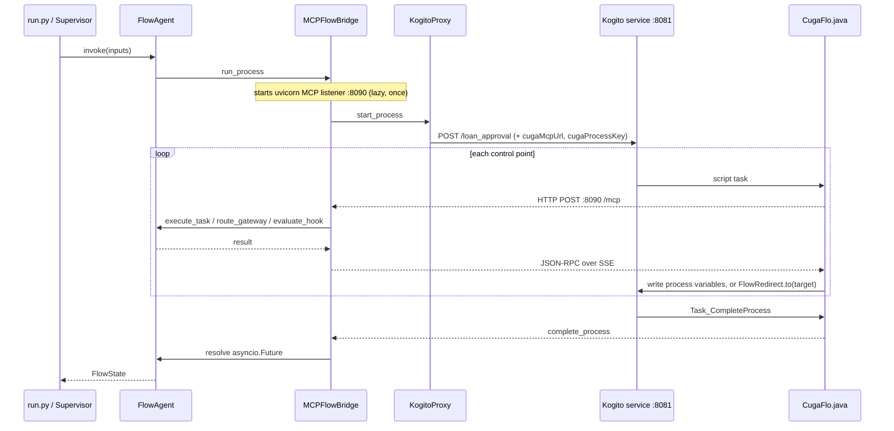

# CUGA FLO ↔ Apache KIE (Kogito) — Integration Report

**Status:** complete and verified against a live Kogito service with real LLM reasoning.
**Stack:** Apache KIE / Kogito 10.2.0 · Quarkus 3.27.2 · JDK 17.
**Delivered in:** 19 commits on `cugaflo`.

---

## 1. Objective and outcome

Add Apache KIE (Kogito) as a third `WorkflowEngine` alongside LangGraph (in-process demo)
and Flowable, so a BPMN process can execute on a Kogito/Quarkus service while CUGA FLO
supplies LLM reasoning at every control point.

The real test was whether the engine seam is genuine: a third engine should drop in without
touching `FlowAgent`, `DecisionAgent`, `TaskAgent`, or the MCP tool contract.

**It did.** Not one line of the reasoning layer changed. The additions are a REST proxy, a
bridge registration method, a dispatch branch, a Java runtime compiled into the Kogito
service, and a build script. The `loan_approval` policies are reused **byte-identical** from
the Flowable app, which is the strongest evidence that policy and engine are properly
separated.

One existing behaviour was corrected: engine dispatch previously fell through to LangGraph
for any unrecognised `workflow_engine.type`, so a typo would silently run the wrong engine.
It now raises.

---

## 2. Prerequisites and setup

Only two things are strictly required to build and run a Kogito app: **JDK 17+** and
**Maven**. Everything else below is optional tooling.

### JDK 17+ (required)

Kogito 10.2.0 targets Java 17. A system JDK 11 fails with
`UnsupportedClassVersionError: class file version 61.0`.

```bash
brew install openjdk@17
export JAVA_HOME=/opt/homebrew/opt/openjdk@17
export PATH="$JAVA_HOME/bin:$PATH"     # add to ~/.zshrc to make it stick
```

The Homebrew formula is **keg-only**: it is not symlinked into
`/Library/Java/JavaVirtualMachines`, so `/usr/libexec/java_home` cannot see it and
`JAVA_HOME` must be set explicitly. The `temurin@17` cask registers properly instead, but its
installer needs interactive `sudo`.

`scripts/build_kogito_app.sh` probes the usual locations if `JAVA_HOME` is unset, and bakes
whatever it finds into the generated `run.sh` — so the service always starts on the JDK it
was built with, regardless of the shell's `PATH`.

### Maven 3.9+ (required)

```bash
brew install maven
```

The build script drives `mvn` directly. First build downloads the Quarkus and Kogito
dependency trees and takes a few minutes; later builds are seconds.

### Quarkus CLI (optional)

```bash
brew install quarkusio/tap/quarkus
```

Convenient for `quarkus dev` and extension queries, but **not used by the build script**.
Note it is itself a Java 17+ program, so it fails the same way on a system JDK 11. Also note
Kogito is absent from the Quarkus platform catalog — `quarkus create app
--extension=kogito-quarkus` does not work; the BOM has to be imported by hand, which
`pom.xml.template` already does.

### Docker (optional)

Needed only for the Kogito Management Console UI (§6) and for the Flowable container if
comparing engines. Not needed to build or run a Kogito app.

### KIE BPMN Editor for VS Code (recommended)

Graphical editing of BPMN models, from the
[Apache KIE™ Kogito Bundle](https://marketplace.visualstudio.com/items?itemName=kie-group.vscode-extension-kogito-bundle)
extension:

```bash
code --install-extension kie-group.vscode-extension-kogito-bundle
```

It renders `.bpmn` / `.bpmn2` as diagrams and `.dmn` as decision models, replacing the raw
XML view. This is an **authoring** extension only — it has no runtime view, so it cannot show
process instances or execution traces (see §6).

Two cautions when using it on CUGA FLO models:

- The `*-kogito.bpmn` models here are **hand-written** and carry script tasks, `drools:import`
  declarations and typed `<bpmn2:property>` blocks. The editor does round-trip all of that
  safely — verified on a re-save, with node, flow and property counts unchanged and the model
  still building — but the file is **not** byte-identical: it regenerates the
  `definitions` / `collaboration` / `participant` ids, reorders elements and rewrites diagram
  bounds. Commit before opening one, so that churn is visible in the diff.
- Edit the model in the app's `config/` directory, never the copy the build script places
  under `build/kogito/<app>/src/main/resources/org/cuga/`, which is overwritten every build.

### Verify the toolchain

```bash
java -version     # 17 or higher
mvn -v            # 3.9 or higher
./scripts/build_kogito_app.sh loan_approval_kogito
```

A successful build ends by printing the `run.sh` path to start the service.

---

## 3. Round trip at a control point



`run_process` returns `{}` immediately; `invoke()` blocks on a future that only
`complete_process` resolves. **Every terminal branch must reach the completion task**, or
the call never returns.

---

## 4. What was built

| Component | Path | Role |
|---|---|---|
| `KogitoProxy` | `backend/server/kogito/kogito_proxy.py` | Sync httpx client over Kogito's generated REST API |
| `CugaFlo.java` | `backend/server/kogito/` | MCP client for all four control points, compiled into the service |
| `FlowRedirect.java` | `backend/server/kogito/` | In-process hook redirect |
| Scaffolding templates | `backend/server/kogito/pom.xml.template`, `application.properties.template` | Generated project |
| `register_kogito_engine` | `backend/server/cuga_flo_mcp/bridge.py` | Registers `run_process`, injects `cugaMcpUrl` |
| Engine dispatch | `cuga_flow/flow_config.py` | `elif "kogito"`, plus a raising `else` |
| Build script | `scripts/build_kogito_app.sh` | App directory → runnable Quarkus service |
| Demo app | `docs/examples/.../loan_approval_kogito/` | Config, both BPMN models, policies |
| Know-hows | `.../model_transform_knowledge/kogito/` | Per-element transformation procedures |
| Docs | `cuga_flow/README-KOGITO.md` | Integration reference |

The Java runtime is **shared, not per-app** — both classes are parameterised entirely
through the arguments their BPMN script tasks pass, so a per-app copy would be identical.

---

## 5. Structural findings

Four discoveries shaped the design. The first two were anticipated risks; the rest were not.

### 5.1 No runtime BPMN deploy — by design, scoped out

Kogito compiles BPMN into the Quarkus service at build time. There is no counterpart to
`FlowableProxy.deploy()`. `KogitoProxy` ships without one, and apps are scoped to
statically-known processes. This drives the whole build-then-run lifecycle.

### 5.2 In-process redirect — the top risk, resolved

Flowable's hook redirect works only because `Task_DynamicSkip` calls
`ChangeActivityStateBuilder` inside the same JVM and transaction; the REST equivalent exists
but is unused, because REST reads committed state and races the in-flight script task.

Kogito's equivalent was unconfirmed and gated everything. A spike
(`backend/server/kogito/redirectspike.bpmn`) resolved it in two lines:

```java
((NodeInstance) kcontext.getNodeInstance()).cancel();               // suppress nominal flow
pi.getNodeInstance(target).trigger(null, CONNECTION_DEFAULT_TYPE);  // jump
```

| Hook action | target | trail | |
|---|---|---|---|
| SKIP_TO | `Task_D` | `A,D` | B skipped |
| CONTINUE | `""` | `A,B,D` | nominal path |
| TERMINATE | `End_1` | `A` | jumps to end |

**The self-cancel is load-bearing.** Without it the redirect fires *and* the calling node's
outgoing flow continues, giving `A,D,B,D` — both paths run.

The race that forced Flowable's redirect in-process **cannot arise here by construction**:
`FlowRedirect` runs synchronously on the script task's own thread after the HTTP call
returns, leaving no window for a competing token.

### 5.3 Boundary events are illegal on script tasks

*"Boundary events are supported only on StateBasedNode, found node: ActionNode."* Flowable's
hook shape — scriptTask + boundaryEvent + shared `Task_DynamicSkip` — **cannot be ported
literally**. Preserving it would mean making every hook a service task purely to satisfy the
restriction.

Given 5.2 it is unnecessary: the hook is **one script task**, and all three actions collapse
into a single `FlowRedirect.to` call, since a blank target is a no-op. The Kogito hook has
fewer moving parts than the Flowable one.

### 5.4 Kogito's script validator rejects Java FQNs

`org.jbpm.Foo` inside `<bpmn2:script>` fails the build with *"uses unknown variable in the
script: org"*. Every script is therefore a one-liner delegating to a class declared via
`<drools:import>` — which is why `CugaFlo` and `FlowRedirect` exist as real classes rather
than inline script. This is an improvement over Flowable's 30-line inline Nashorn blocks.

---


## 6. Monitoring

A bare Kogito service keeps **no history** — it finishes an automated process inside the
start call and then 404s the instance. The process-management addon exposes definitions, not
runs, and `org.jbpm` DEBUG logging emits no node transitions.

Generated services therefore embed `kogito-addons-quarkus-data-index-inmemory`, exposing
GraphQL at `/graphql`:

```
84522e81  COMPLETED  10 nodes
    ActionNode  CUGA FLO hook: pre credit check
    ActionNode  check credit
    ActionNode  route gateway decision
    Split       credit decision
    ActionNode  CUGA FLO hook: approval intercept
    ActionNode  give loan of 1000 USD
    Join        merge
    ActionNode  CUGA FLO complete process
```

`variables` carries the terminal state, making this the practical way to see what a hook or
gateway decided.

### Management Console UI

The Kogito Management Console is a browser view over the **same** embedded Data Index — it
adds no data and needs no separate Data Index service. It talks straight to the app:

```
browser ──▶ Management Console (:8280)  ──▶  /graphql on the Kogito app (:8081)
                  static React app              embedded Data Index
```

With the app already running and having executed at least one process:

```bash
docker run -d --name kogito-mc -p 8280:8080 \
  apache/incubator-kie-kogito-management-console:10.2.0

docker rm -f kogito-mc          # stop it
```

Open http://localhost:8280 and enter the runtime URL `http://localhost:8081`. The 10.x
console takes that **through the UI**, as a route param — there is no environment variable
for it, and `KOGITO_DATAINDEX_HTTP_URL` is silently ignored.

Because the console is a static app, the **browser** makes the GraphQL calls, not the
container. Two consequences, both already handled in the generated
`application.properties`:

| Setting | Without it |
|---|---|
| `quarkus.http.cors=true` | The browser drops every response; the console reports *"Could not communicate with runtime"*. |
| `kogito.service.url` | Instances record `serviceUrl: null`; the console lists them but cannot open one — *"Error fetching data"*. |

Listing instances only reads `/graphql`, whereas opening one — and every action on it — calls
back into the runtime at its recorded `serviceUrl`. That is why the list can work while the
detail view fails.

Note the console image is amd64-only, so it runs under emulation on Apple Silicon and is
slow. Data Index is per-service-lifetime, so restarting the app clears history — run a fresh
process before reconnecting. Full troubleshooting is in `README-KOGITO.md`.

Two addons were evaluated and rejected: `kie-addons-quarkus-events-process` (Data Index needs
no help from it, and it drags in reactive-messaging whose metric decorator fails on a missing
`MetricRegistry`) and `kie-addons-quarkus-process-svg` (serves a `.svg` exported from the KIE
editor rather than rendering from BPMNDI).

**Reading the timeline:** `enter` has millisecond granularity, so adjacent deterministic
nodes tie and cannot be ordered — a console showing `merge` before `give loan` is that, not a
routing anomaly. `exit` is the process end time on every node, so durations come from gaps
between consecutive `enter` values. On a sample run, all but ~4ms of 20.1s was the four LLM
control points.

---


## 7. Lifecycle

With the toolchain from §2 in place:

```bash
./scripts/build_kogito_app.sh <app-name>     # app dir -> build/kogito/<app-name>
build/kogito/<app-name>/run.sh               # service on 8081
source .venv/bin/activate
cuga start flow_agent_inline <app-name>      # then http://127.0.0.1:8001
```

Only the build step repeats after a BPMN change; yaml and policies are read live.

Two ports to keep straight: Quarkus and the Flowable demo container both default to **8080**,
so Kogito apps are pinned to **8081**. A Tomcat-styled 404 means a request reached Flowable
instead of Kogito.

---

## 8. References

| Document | Covers |
|---|---|
| `docs/diagrams/cuga-flo-workflow-engines.md` | Architecture across all three engines |
| `cuga_flow/README-KOGITO.md` | Integration reference, monitoring, troubleshooting |
| `.../model_transform_knowledge/kogito/` | Per-element BPMN transformation procedures |
| `.../model_transform_knowledge/flowable/` | The Flowable equivalents, for comparison |
