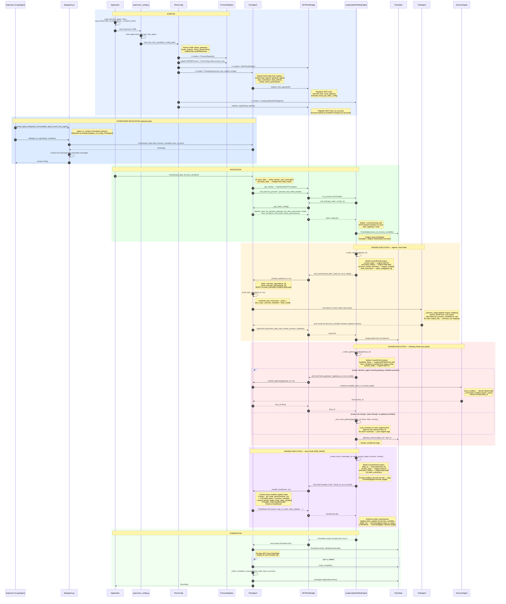

# CUGA FLO Lifecycle — Sequence Diagram

```mermaid
sequenceDiagram
    autonumber
    participant Sup as Supervisor (CugaAgent)
    participant Deleg as delegation.py
    participant App as Application
    participant SC as supervisor_config.py
    participant FC as FlowConfig
    participant Reg as ProcessRegistry
    participant FA as FlowAgent
    participant Bridge as MCPFlowBridge
    participant Eng as LangGraphWorkflowEngine
    participant FS as FlowState
    participant TA as TaskAgent
    participant DA as DecisionAgent

    rect rgb(230, 240, 255)
        Note over App,Reg: STARTUP
        App->>App: cuga start flow_agent_inline<br/>sets DYNACONF_SUPERVISOR__CONFIG_PATH
        App->>SC: load supervisor YAML
        SC->>SC: finds agent entry with type: flow_agent
        SC->>FC: load_flow_from_yaml(flow_config_path)
        Note right of FC: Parses YAML (tasks, gateways,<br/>hooks, policies, action_permissions)<br/>+ BPMN file via BPMNParser
        FC->>Reg: <<create>> ProcessRegistry()
        FC->>Reg: register BPMNProcess + FlowConfig under process_key
        FC->>Bridge: <<create>> MCPFlowBridge()
        FC->>FA: <<create>> FlowAgent(process_key, registry, bridge)
        Note right of FA: Reads FlowConfig from registry:<br/>creates task_agents, gateway_agents<br/>task_instructions, task_policies<br/>hooks, action_permissions
        FA->>Bridge: register_flow_agent(self)
        Note right of Bridge: Registers MCP tools:<br/>execute_task, route_gateway<br/>evaluate_hook, get_static_config
        FC->>Eng: <<create>> LangGraphWorkflowEngine()
        FC->>Bridge: register_engine(eng, registry)
        Note right of Bridge: Registers MCP tool: run_process<br/>All tools backed by FastMCPTransport (in-process)
    end

    rect rgb(220, 235, 255)
        Note over Sup,FA: SUPERVISOR DELEGATION (optional path)
        Sup->>Deleg: create_agent_delegation_func(adapter, agent_name, flow_agent)
        Note right of Deleg: agent_or_config is FlowAgent instance<br/>Detected via isinstance(agent_or_config, FlowAgent)
        Sup->>Deleg: delegate_to_agent(task, variables)
        Deleg->>FA: invoke(input_data=task, process_variables=vars_to_pass)
        FA-->>Deleg: FlowState
        Deleg->>Deleg: extract last message from FlowState.messages
        Deleg-->>Sup: answer string
    end

    rect rgb(230, 255, 230)
        Note over App,Eng: INVOCATION
        App->>FA: invoke(input_data, process_variables)
        Note right of FA: str input_data → initial_inputs["_user_message"]<br/>dict input_data → merged into initial_inputs
        FA->>Bridge: get_client() — Client(FastMCPTransport)
        FA->>Bridge: call_tool("run_process", {process_key, initial_inputs})
        Bridge->>Eng: run_process tool handler
        Eng->>Bridge: call_tool("get_static_config", {})
        Bridge->>FA: _get_static_config()
        FA-->>Bridge: {agentic_task_ids, decision_gateway_ids, task_instructions, hooks,<br/>flow_conditions, tool_tasks, action_permissions}
        Bridge-->>Eng: static config dict
        Note right of Eng: Builds _ControlOverlay with<br/>MCP-backed handlers for each<br/>task / gateway / hook
        Eng->>FS: FlowState(process_id, process_variables)
        Note right of Eng: Engine owns FlowState<br/>Compiles + begins StateGraph execution
    end

    rect rgb(255, 245, 220)
        Note over Eng,TA: ENGINE EXECUTION — Agentic Task Node
        Eng->>Eng: _create_task_node(task_id)
        Note right of Eng: Builds ControlPointContext:<br/>current_state — engine-held FS<br/>execution_history — engine-held path<br/>process_model_summary — inspect_model()<br/>task_instruction — static config[task_id]
        Eng->>Bridge: call_tool("execute_task", {task_id, ctx.to_dict()})
        Bridge->>FA: _handle_task(task_id, ctx)
        Note right of FA: WHO: self.task_agents[task_id]<br/>HOW: self.task_policies[task_id]<br/>WHAT: ctx.task_instruction (engine disclosed)
        FA->>FA: _build_task_input(task_id, ctx)
        Note right of FA: combines task_instruction + policy +<br/>user_msg + process_variables + task_results
        FA->>TA: execute(ctx.current_state, task_input)
        Note right of TA: _process_output applies output_mapping:<br/>parses JSON from LLM output<br/>calls state.set_process_variable(var, val)<br/>for each output_key → process_var mapping
        TA-->>FA: task result dict (process_variables already updated in-place)
        FA-->>Bridge: partial dict {execution_path, task_results, process_variables}
        Bridge-->>Eng: result dict
        Eng->>FS: merge partial dict via reducers
    end

    rect rgb(255, 235, 235)
        Note over Eng,DA: ENGINE EXECUTION — Gateway Node (two paths)
        Eng->>Eng: _create_gateway_node(gateway_id)
        Note right of Eng: Builds ControlPointContext:<br/>available_flows — outgoing BPMNFlows with<br/>flow_conditions overlaid from static config<br/>current_state — engine-held FS

        alt mode: decision_agent (overlay.gateway_handlers present)
            Eng->>Bridge: call_tool("route_gateway", {gateway_id, ctx.to_dict()})
            Bridge->>FA: _handle_gateway(gateway_id, ctx)
            FA->>DA: route(ctx.available_flows, ctx.current_state)
            Note right of DA: eval_condition → decide StateGraph<br/>LLM reads condition result + policy<br/>returns chosen flow_id
            DA-->>FA: chosen flow_id
            FA-->>Bridge: flow_id string
            Bridge-->>Eng: flow_id
        else mode: tool (merge / pass-through, no gateway handler)
            Eng->>Eng: _tool_route_gateway(gateway_id, flows, state, overlay)
            Note right of Eng: eval_condition on each outgoing flow<br/>Returns first matched flow_id<br/>No MCP round-trip — pure engine logic
        end

        Eng->>FS: gateway_decisions[gw_id] = flow_id
        Note right of Eng: Routes conditional edge
    end

    rect rgb(245, 230, 255)
        Note over Eng,FA: ENGINE EXECUTION — Hook Node (PRE_EDGE)
        Eng->>Eng: _create_hook_node(edge_id, hook, normal_target, process, overlay)
        Note right of Eng: Builds ControlPointContext:<br/>edge_id — intercepted flow ID<br/>current_state — engine-held FS<br/>execution_history — engine-held path<br/>(no task_instruction)
        Note right of Eng: If hook.condition set and not met → skip,<br/>Command(goto=normal_target)
        Eng->>Bridge: call_tool("evaluate_hook", {hook_id, ctx.to_dict()})
        Bridge->>FA: _handle_hook(hook, ctx)
        Note right of FA: Checks hook.condition against state<br/>If policy: _llm_hook_decision(hook, ctx)<br/>  → LLM reads policy + process_variables<br/>  → returns {action, target_node, state_updates}<br/>If handler: hook.handler(state)<br/>Returns HookResult
        FA-->>Bridge: HookResult dict {action, skip_to_node, state_updates, ...}
        Bridge-->>Eng: HookResult dict
        Note right of Eng: Enforces action_permissions<br/>Applies state_updates to process_variables<br/>SKIP_TO → Command(goto=skip_to_node)<br/>CONTINUE → Command(goto=normal_target)
    end

    rect rgb(240, 255, 240)
        Note over Eng,App: COMPLETION
        Eng-->>Bridge: FlowState.model_dump(mode="json")
        Bridge-->>FA: result.data (FlowState dict)
        FA->>FS: FlowState.model_validate(result.data)
        Note right of FA: FA does NOT store FlowState<br/>Ready for next invoke() call
        alt not is_halted
            FA->>FS: mark_complete()
        end
        FA->>FA: _build_completion_message(final_state, bpmn_process)
        FA->>FS: messages.append(summary)
        FA-->>App: FlowState
    end
```
