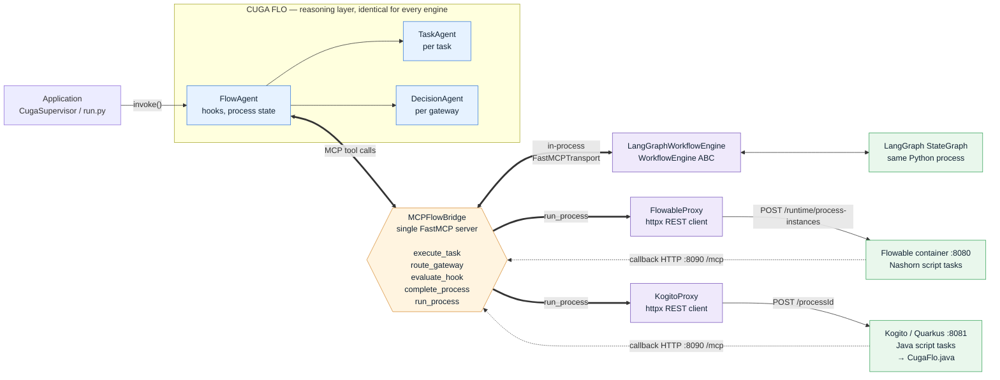

# CUGA FLO — Workflow Engine Architecture

How CUGA FLO drives three interchangeable BPMN runtimes through one MCP server. The
reasoning layer (`FlowAgent`, `TaskAgent`, `DecisionAgent`) is identical in all three
configurations — only the engine adapter and the runtime differ.



**Solid arrows are outbound** (CUGA FLO starting a process). **Dotted arrows are callbacks**
— the external runtimes reaching back into CUGA FLO for reasoning at each control point.

---

## The seam

Everything crosses one contract: **`MCPFlowBridge`**, a single FastMCP server. There is no
per-engine bridge and no second MCP server.

| Direction | Tool | Registered by | Called by |
|---|---|---|---|
| CUGA FLO → engine | `run_process` | the selected adapter | `FlowAgent.invoke()` |
| engine → CUGA FLO | `execute_task` | FlowAgent | a task control point |
| engine → CUGA FLO | `route_gateway` | FlowAgent | a gateway control point |
| engine → CUGA FLO | `evaluate_hook` | FlowAgent | a hook control point |
| engine → CUGA FLO | `complete_process` | FlowAgent | the process terminating |
| — | `register_flow`, `get_bpmn_process`, `get_flow_annotations` | ProcessRegistry | engine / config load |

`run_process` is **fire-and-forget**: it returns `{}` immediately. `FlowAgent.invoke()` then
blocks on an `asyncio.Future` that only `complete_process` resolves. This is why a ported
model must reach its completion task on *every* terminal branch — miss one and the call
never returns.

---

## Two transports, one contract

| | LangGraph | Flowable | Kogito |
|---|---|---|---|
| Adapter | `LangGraphWorkflowEngine` | `FlowableProxy` | `KogitoProxy` |
| Subclasses `WorkflowEngine` ABC | yes | no | no |
| Transport | in-process `FastMCPTransport` | HTTP | HTTP |
| Runtime location | same Python process | Docker container | Quarkus service |
| Callback mechanism | direct MCP client | Nashorn JS in script tasks | `CugaFlo.java` in script tasks |
| BPMN deployed at | compile of the StateGraph | runtime, via REST | **build time** — no runtime deploy |
| Hook redirect | graph recompile | `BpmnError` + boundary event + `Task_DynamicSkip` | `FlowRedirect.to()`, in-process |

The `WorkflowEngine` ABC is **not** what unifies these — only LangGraph implements it. The
real contract is the `run_process` MCP tool, which is why the two proxies need no common
base class.

For the external engines the bridge additionally starts a **uvicorn HTTP listener on
`callback_port` (8090)**, lazily on first `run_process`, so script tasks running inside the
container or JVM can call back in. The MCP URL is passed to the runtime as a process
variable (`cugaMcpUrl`) rather than hardcoded, because the right host differs between a
container (`host.docker.internal`) and a service on the host (`localhost`).

---

## What stays identical across engines

Selecting an engine is a YAML change:

```yaml
workflow_engine:
  type: langgraph | flowable | kogito
```

Unchanged in all three: the `policies/` markdown, the `tasks:` / `gateways:` / `hooks:`
config, the clean `BPMNdiagram.bpmn` CUGA FLO parses, and every agent class. What changes is
the engine-specific BPMN model — `*.bpmn20.xml` for Flowable, `*-kogito.bpmn` for Kogito,
none for LangGraph, which compiles the clean model directly.

See `README-FLOWABLE.md`, `README-KOGITO.md`, and the per-element procedures under
`docs/examples/flow_agent_app_inline/model_transform_knowledge/`.
